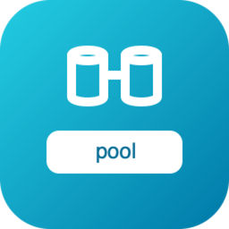

# go-volumes

Pure-Go copy-on-write **pooled volume manager** — a small, ZFS-inspired
alternative to LVM thin provisioning. No cgo, no root, no device-mapper.

A **pool** owns a flat array of fixed-size physical blocks backed by a single
file. **Volumes** are logical block devices carved out of the pool;
**snapshots** are immutable, reference-counted captures; **clones** are instant,
space-shared writable branches. Writes are copy-on-write, so overwriting a block
shared with a snapshot allocates a fresh block and leaves the snapshot
untouched.

It pairs with [go-filesystems](https://github.com/go-filesystems): a `Volume`
implements the same block-backend shape (`ReadAt`/`WriteAt`/`Sync`/`Size`/
`Truncate`/`Close`) those ext4/xfs drivers accept via `OpenFromDevice`, so you
can format and mount a real filesystem straight onto a pool volume.

## Components

<a class="fs-card" href="components/pool.md"><code>pool</code> <small>CoW pooled volume manager — volumes, snapshots, clones, sparse raw export/import.</small></a>

## Why not LVM?

LVM thin snapshots can **corrupt** when the pool fills past a threshold: ext4 (or
XFS) overwrites in place and assumes its blocks are durable, but the thin pool
needs a *new* block for the copy-on-write — and if none is free, the write fails
mid-operation and the filesystem/snapshot is left inconsistent.

`go-volumes` is built so that can't happen — see [Concepts](concepts.md).
